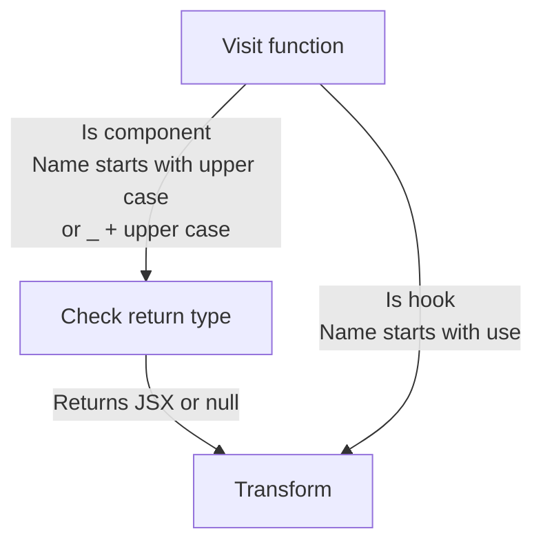
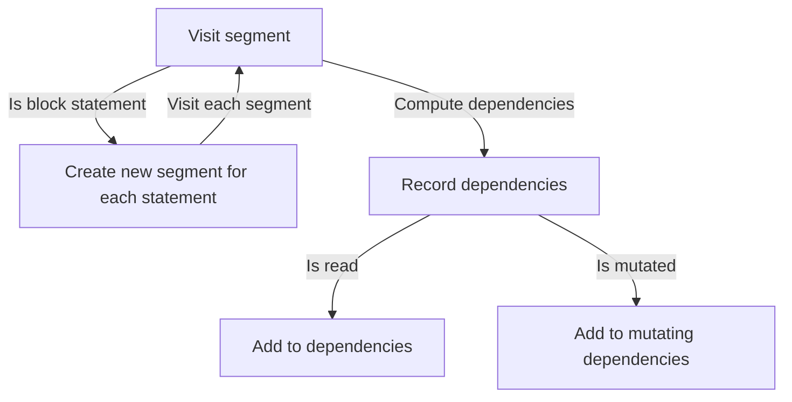
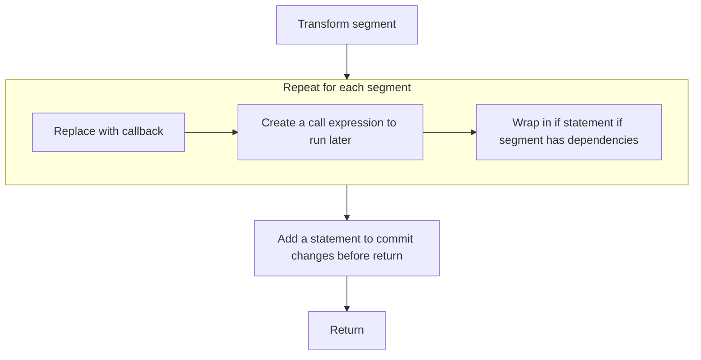

React Unforget starts by visiting each function in the program. Functions whose ids look like React components or hooks will be considered for transformation. For components, the return type is also considered which must be `null` or `JSXElement`s.



### Transform

Transformation is done in two steps:

1. **Computing dependency graph**
2. **Transforming segments**

The first step after detecting hooks and components is to compute the dependency graph. This is done by creating a segment from the root block statement and do a dependency graph traversal.

### Dependency graph

A segment can be any statement including block statement, control flow statement, or expression statement.

If a segment is a block statement, it will create a new segment for each statement in the block during the computation of the dependency graph. This continues recursively until we reach the end of the tree.

At the same time, the dependency graph is computed by visiting each runnable segment and recording the dependencies of each segment. The dependencies are the variables that are read by the segment. Also, there's a special dependency called "mutating" dependencies which is for variables that are modified by the segment e.g. re-assigned, ot mutated using a method call.



During the computation of the dependency graph, we also unwrap the JSX elements and create segments for each expression in the JSX element. This is done by creating a new segment for each expression in the JSX element and then adding the segment to the dependency graph.

```tsx
const jsx = (
  <div onClick={() => setValue(2)}>
    <p>Hello {text}</p>
  </div>
);
```

is transformed to:

```tsx
const _unwrappedJsxExp = () => setValue(2);
const _unwrappedJsxEl = <p>Hello {text}</p>;
const _unwrappedJsxEl2 = <div>{_unwrappedJsxEl}</div>;
```

This allows us to later memoize each JSX element and its expressions separately.

Also, we separate the declarations for variables declared with array or object patterns. This allows us to separately memoize each variable in the pattern.

```tsx
const [a, { value: newValue }] = useValue();
```

is transformed to:

```tsx
const _unwrapped = useValue();
const a = _unwrapped[0];
const newValue = _unwrapped[1].value;
```

### Transformation

The segments are transformed in the order determined by the dependency graph. For each block, we do a topological sort of the segments and then transform them in that order using a simple depth-first search. The transformation replaces the runnable segment with callback function. If the segment was a variable declaration, it will be replaced with a non-const variable declaration whose initial value comes from the cache so it can be re-assigned by the callback.

Original code:

```tsx
const value = useValue();

console.log("Hello world")!;
```

Results in:

```tsx
let value;
const _segment = () => {
  value = useValue();
};

const _segment2 = () => {
  console.log("Hello world")!;
};
```

For component variables, it will be replaced with a non-const variable declaration whose initial value comes from the cache so it can be re-assigned by the callback. For the cache, we use a custom hook from `@react-unforget/runtime` called `useCreateCache$unforget`. The hook returns an array with 3 elements: the cache array, a function to commit the changes, and a reference to a symbol that represents the null state of the cache.

```tsx
const [state, setState] = useState();

return <div>{state}</div>;
```

Results in:

```tsx
/*
Create a cache of size 3

0 => _unwrapped
1 => state
2 => setState
*/
const [_$unforgetCache, _$unforgetCommit, _$unforgetNull] =
  useCreateCache$unforget(3);

// Use the cache value as the initial value
let _unwrapped = $unforgetCache[0].v;

const _segment = () => {
  _unwrapped = useState();
  // This enqueue the changes to the cache
  $unforgetCache[0].e(_unwrapped);
};

let state = $unforgetCache[1].v;
const _segment2 = () => {
  state = _unwrapped[0];
  $unforgetCache[1].e(state);
};

let setState = $unforgetCache[2].v;
const _segment3 = () => {
  setState = _unwrapped[1];
  $unforgetCache[2].e(setState);
};

// return
```

After declaring each segment callable, we add call expressions for each segment in the order determined by the dependency graph. Also, if the segment has dependencies, it will be called inside an if statement that checks if the dependencies have not changed.

```tsx
// .n checks if the cache is in the unset state
if ($unforgetCache[0].n || _unwrapped !== $unforgetCache[0].v) {
  _segment();
}

if ($unforgetCache[1].n || state !== $unforgetCache[1].v) {
  _segment2();
}

if ($unforgetCache[2].n || setState !== $unforgetCache[2].v) {
  _segment3();
}

// commit the changes to the cache
$unforgetCommit();
// return
```


